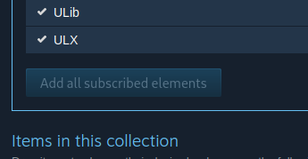

# Tidebringer

Firefox extension to simplify some operations on the Steam Workshop

> [!Note]
>
> Valve [has implemented this functionality directly on Steam](https://steamcommunity.com/games/SteamWorkshop/announcements/detail/3889485345756435017), this extension is not needed anymore.

## Links

## Screenshots

